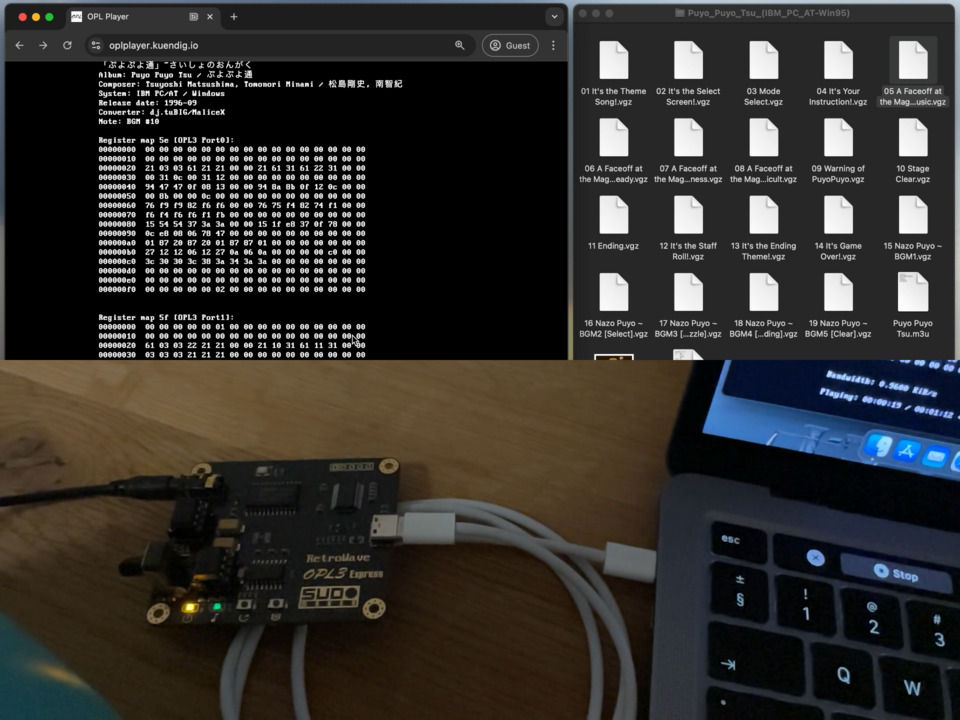

# Web OPL3 Player

This project allows you to play music on OPL3 sound chips via the Web Serial API. It's a Javascript + Webassembly implementation of the RetroWavePlayer and does not rely on emulation, so it only works with a physical device. 

It's  been tested on the [RetroWave OPL3 Express (v2)](https://shop.sudomaker.com/products/retrowave-opl3-express), but should generally work with any OPL3 chip connected via serial port.  

# Demo
[ (Youtube)](https://www.youtube.com/watch?v=JMKBpi5cIN8)

# License + Credits
- My own [Webassembly port](https://github.com/chkuendig/RetroWave) of RetroWavePlayer and RetroWaveLib based on [SudoMaker/RetroWave](https://github.com/SudoMaker/RetroWave) (AGPL-3.0 license)
- The Terminal Font is [Perfect DOS VGA 437 Win](perfect_dos_vga_437/dos437.txt) by [Zeh Fernando](https://www.zehfernando.com) (Freeware)
- Terminal itself is [Xterm.js](https://xtermjs.org/) with [mame/xterm-pty](https://github.com/mame/xterm-pty)  (both  MIT license)
- The demo songs are from the Sound Blaster Series Demo Disc available at [vgmrips.net](https://vgmrips.net/packs/pack/sound-blaster-series-demo-songs-ibm-pc-xt-at)
